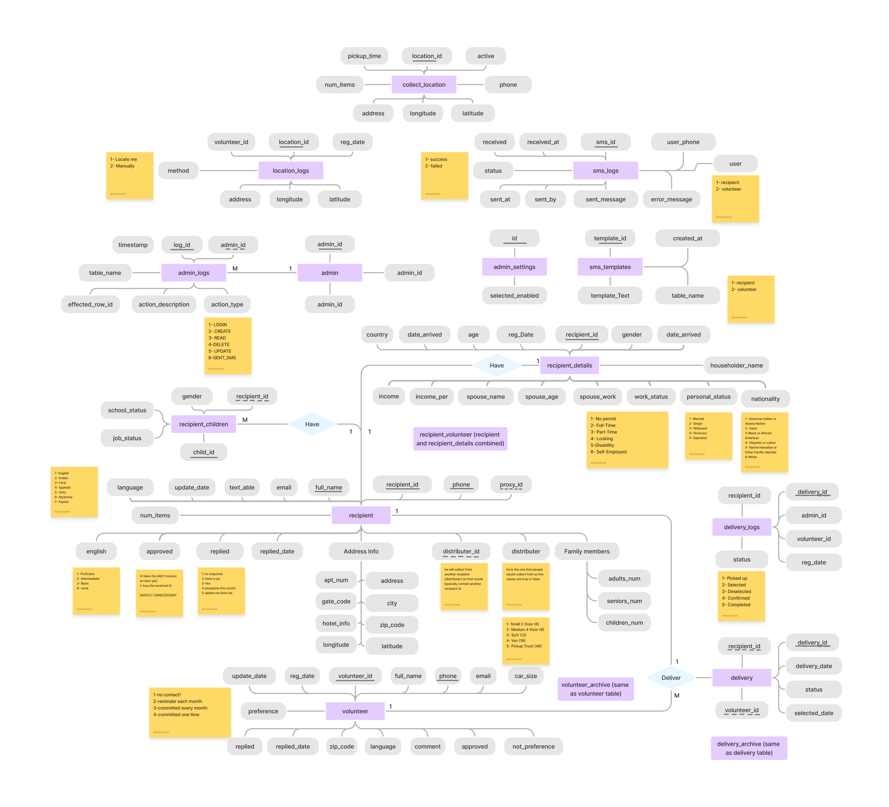

# AID System - Community Aid Management System  
*Connecting Families in Need with Compassionate Volunteers*  

---

## 📌 Overview  
AID System is a multilingual platform designed for the American Islamic Diversity (AID) organization to streamline food pantry deliveries and manage recipients and volunteers. It enables:
- **Recipients** to register for aid and update their information.  
- **Volunteers** to sign up, view deliveries, and coordinate pickups.  
- **Admins** to manage logistics, SMS campaigns, and real-time delivery tracking.  

## Documentation

📄 **Online Docs**: [View the Documentation](./Docs/SystemDocumentation.docx)  
📄 **PDF Version**: [View the PDF](./Docs/SystemDocumentation.pdf)

---

## ✨ Features  
- **Multilingual UI**: Supports 7 languages (English, Arabic, Farsi, Urdu, Spanish, Myanmar, Pashto).  
- **Interactive Map**: Real-time visualization of recipients, volunteers, and pickup locations via Leaflet.js.  
- **SMS Integration**: Automated registration confirmations, reminders, and delivery updates via Twilio.  
- **Admin Dashboard**: Manage volunteers, recipients, deliveries, and logs.  
- **Call Routing**: Forward calls to staff with IVR menus and whisper alerts.  

---

## 🛠️ Tech Stack  
**Frontend**:  
- HTML, CSS, JavaScript, PHP  
- Leaflet.js, OpenCage Geocoder, MapBox  

**Backend**:  
- PHP, MySQL  
- Twilio (SMS/calls), Font Awesome (icons)  

**Infrastructure**:  
- Apache/Nginx, MySQL 5.7+  

---

## 🚀 Installation  
### Prerequisites  
- PHP 7.4+  
- MySQL 5.7+  
- Twilio Account ([Sign Up](https://www.twilio.com/try-twilio))  
- OpenCage API Key ([Get Key](https://opencagedata.com/api))
- MapBox API Key ([Get Key](https://opencagedata.com/api](https://www.mapbox.com/address-autofill)))
- FontAwsome API Key ([Get Key](https://fontawesome.com/start))

### Steps  
1. **Database Setup**:  
   - Import the `DB.sql` file (located in `extras/DB.sql`) into your MySQL database using phpMyAdmin or CLI.
   - Replace DB_SERVER_NAME, DB_USERNAME, DB_PASSWORD and DB_NAME values (located in `php/db.php`) with your server connection credentials.
2. **API Key Names**:
   - Search for the following names (Cmd+Shift+F on VScode) and change them with your API key:
     - FONTAWESOME_API_KEY
     - OPEN_CAGE_API_KEY
     - MAPBOX_API_KEY
     - TWILIO_ACCOUNT_SID
     - TWILIO_AUTH_TOKEN
     - TWILIO_RECIPIENT_PHONE_NUMBER
     - TWILIO_VOLUNTEER_PHONE_NUMBER
